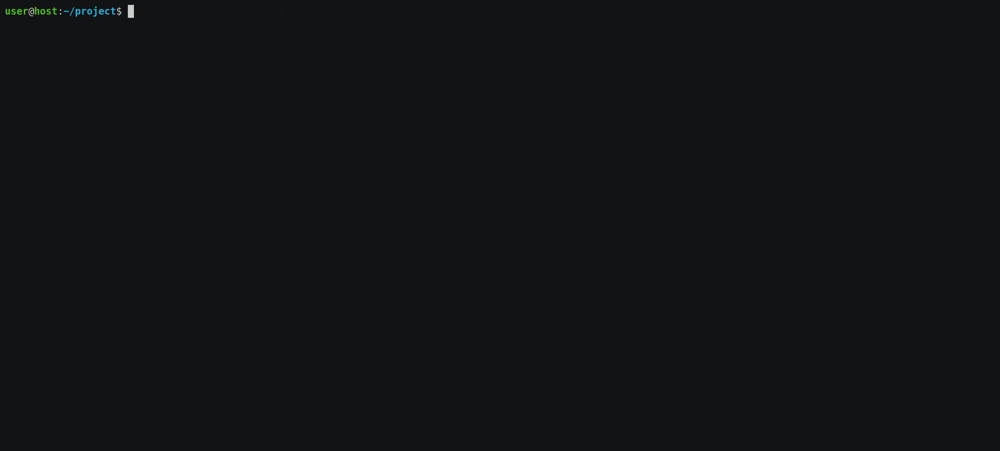

=====
PETRI
=====

petri: free your python code from 12-factor boilerplate.
--------------------------------------------------------

.. list-table::
   :widths: 50 50
   :header-rows: 0

   * - Python Version
     - .. image:: https://img.shields.io/pypi/pyversions/petri
        :target: https://www.python.org/downloads/
        :alt: Python Version
   * - Code Style
     - .. image:: https://img.shields.io/badge/code%20style-black-000000.svg
        :target: https://github.com/ambv/black
        :alt: Code Style
   * - Release
     - .. image:: https://img.shields.io/pypi/v/petri
        :target: https://pypi.org/project/petri/
        :alt: PyPI
   * - Downloads
     - .. image:: https://img.shields.io/pypi/dm/petri
        :alt: PyPI - Downloads
   * - Build Status
     - .. image:: https://github.com/pwoolvett/petri/workflows/publish_wf/badge.svg
        :target: https://github.com/pwoolvett/petri/actions
        :alt: Build Status
   * - Docs
     - .. image:: https://readthedocs.org/projects/petri/badge/?version=latest
        :target: https://petri.readthedocs.io/en/latest/?badge=latest
        :alt: Documentation Status
   * - Maintainability
     - .. image:: https://api.codeclimate.com/v1/badges/4a883c99f3705d3390ee/maintainability
        :target: https://codeclimate.com/github/pwoolvett/petri/maintainability
        :alt: Maintainability
   * - License
     - .. image:: https://img.shields.io/badge/license-Unlicense-blue.svg
        :target: http://unlicense.org/
        :alt: License: Unlicense
   * - Coverage
     - .. image:: https://api.codeclimate.com/v1/badges/4a883c99f3705d3390ee/test_coverage
        :target: https://codeclimate.com/github/pwoolvett/petri/test_coverage
        :alt: Test Coverage
   * - Deps
     - .. image:: https://img.shields.io/librariesio/github/pwoolvett/petri
        :alt: Libraries.io dependency status for GitHub repo

------------

Summary
-------

Importing petri equips your app/pacakage with:

* Dotenv file handling using `python-dotenv <https://pypi.org/project/python-dotenv>`_.
* Package metadata (for installed packages), using `importlib-metadata <https://pypi.org/project/importlib-metadata>`_.
* Settings using `pydantic <https://pypi.org/project/pydantic>`_.
* Logging config using `structlog <https://pypi.org/project/structlog>`_.
* Environment switching (prod/dev/test) handling via ENV environment variable.

Motivation
----------

* In order to have same code for dev/production, it all starts with an innocent
  `settings.py`.
* In order to switch between them, it's a
  `good <https://docs.djangoproject.com/en/2.2/topics/settings/#designating-the-settings>`_
  `idea <https://flask.palletsprojects.com/en/1.1.x/config/#development-production>`_
  `to <https://12factor.net/config>`_ use env vars...
* But sometimes, you want to overrride a single variable.
* But sometimes, you want to overrride several variables.
* Plus, colored logs while developing are pretty.
* Plus, structured logs in production look smart.

Features
--------

- [X] Sane defaults for logging:

  - [X] json logs for production.
  - [X] user-friendly (spaced) + colored for development.
  - [X] Enforce root logger's formatting.
- [X] Easy settings:

  - [X] Toggle between configurations using a signle env var.
  - [X] Define default configuration in case the env var is not present.
  - [X] Granular settings override using environment variables.
  - [X] Batch settings override by loading a `.env`.
- Read package metadata (author, version, etc):

  - [X] Lazy-loaded to avoid reading files during imports.
  - [X] For installed packages only.

Install
-------

Install using
poetry ``poetry add petri`` or
pip ``pip install petri`` or
(for dev) ``pip install git+https://github.com/pwoolvett/petri``.

Optionally, also install the ``color`` extra for colored logs using `colorama <https://pypi.org/project/colorama>`_.

Usage
-----

Just define configuration setting(s) and instantiate ``petri.Petri``:

.. code-block:: python

   #  my_package/__init__.py

   from petri import Petri
   from petri.settings import BaseSettings
   from petri.loggin import LogFormatter, LogLevel

   class Settings(BaseSettings):
       SQL_CONNECTION_STRING = 'sqlite:///database.db'  # example setting

   class Production(Settings):
       LOG_FORMAT = LogFormatter.JSON
       LOG_LEVEL = LogLevel.TRACE

   class Development(Settings):
       LOG_FORMAT = LogFormatter.COLOR  # requires colorama
       LOG_LEVEL = LogLevel.WARNING

   pkg = Petri(__file__)

   # demo logs
   pkg.log.info("log away info level",mode=pkg.settings, version=pkg.meta.version)
   pkg.log.warning("this will show", kewl=True)

That's it!. Watch the animation above for results running
`python -c "import my_package"`

Optionally, define an environment variable named `env_file`, to override
the settings:

   - Its value must be the path to a valid, existing file.
   - Its contents must have name=value pairs.
   - The names must be of the form `[MY_PACKAGE]_[SETTING_NAME]`
     (Watch the animation above).

To select which of your settings classes to use, you can:

   + Point the selector envvar (eg: for `my-pkg`, this would be
     `MY_PKG_CONFIG=my_pkg.settings:Production`),
     or

   + Use the `default_config` kwarg when instantiating `petri.Petri`
     (eg: use `pkg = Petri(__file__, default_config="my_pkg.settings:Production")`
     in the example above).

   Of course, you can use both. Petri will attempt to load the selecto envvar,
   and if not found, default to the defined kwarg.

-----

For more info, check the `docs <https://petri.rtfd.org>`_.
